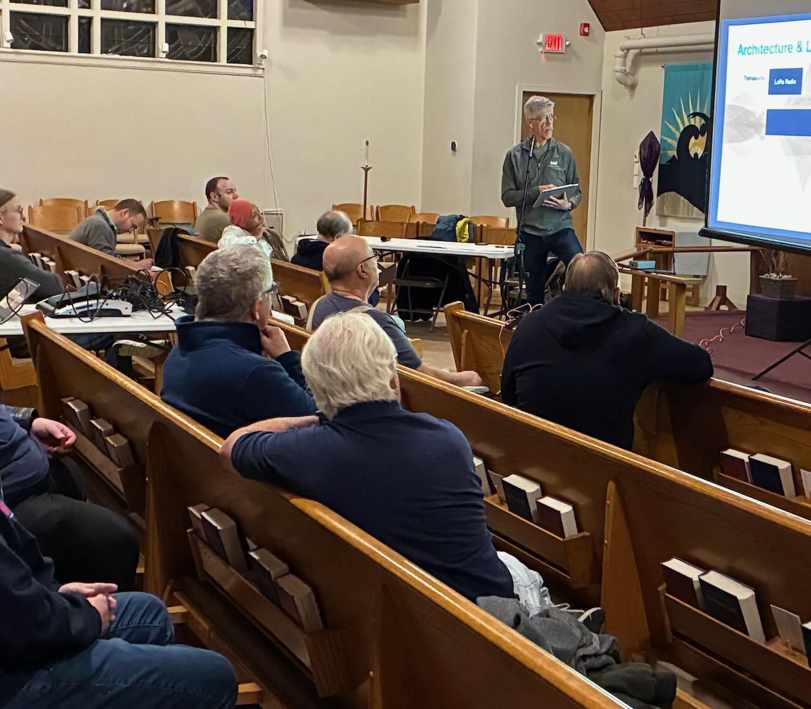
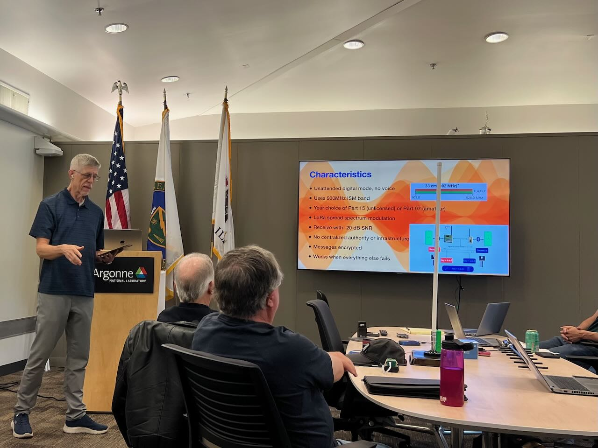

# Meshtastic Ham Club Presentation
Presentation to local ham clubs: Meshtastic - What's In It For Me?

There's an intended double meaning in the title.
This presentation describes what I've found valuable in Meshtastic myself.
But it also describes what a ham club audience might find in it for themselves.

I delivered this presentation at the
[DuPage Amateur Radio Club meeting on February 23, 2026](https://www.w9dup.org)
and at the
[Argonne Amateur Radio Club meeting on May 7, 2025](https://blogs.anl.gov/amateur-radio/page/2/).

My presentation style is heavy on visuals and light on bullets,
with my narration giving the key points verbally.
The GitHub audience necessarily misses out compared to
the live audiences.

You can
[view the presentation PDF in your browser here on GitHub](https://github.com/bobvan/MeshtasticHamClubPresentation/blob/main/Meshtastic-What'sInItForMe%3Fsmaller.pdf)
or
[Download it for offline viewing](https://raw.githubusercontent.com/bobvan/MeshtasticHamClubPresentation/main/Meshtastic-What'sInItForMe%3Fsmaller.pdf).
